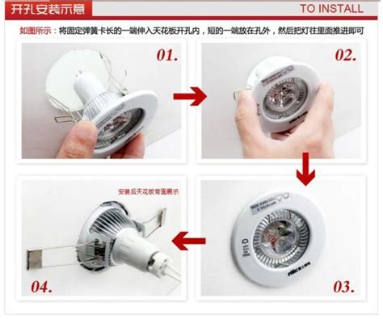

# 💡 更换灯泡指南

以下是一个详细的家用灯泡更换指南，适用于常见的螺口灯泡（如 E27、E14）和插口灯泡（如 G9、GU10、LED 灯管等）。该指南将帮助您安全、有效地完成更换操作。

---

## 🧰 所需工具与材料

- 新灯泡（确保与原灯泡类型、电压和功率匹配）
- 绝缘手套（推荐使用）
- 稳固的踏脚凳或梯子（用于高处灯具）
- 干布或纸巾（用于清洁灯具）
- 电压测试笔（可选，用于确认断电）

---

## ⚠️ 安全提示

1. **切断电源**：在更换灯泡前，务必关闭灯具的电源开关。如果不确定电路情况，建议切断总电源，以确保安全。
2. **避免直接接触灯泡玻璃部分**：特别是卤素灯泡，手上的油脂可能导致灯泡过热，缩短使用寿命。
3. **使用绝缘手套**：在更换灯泡时，佩戴绝缘手套可以防止触电和割伤。
4. **确保站立稳固**：如果需要登高操作，使用稳固的踏脚凳或梯子，避免使用不稳定的家具。

---

## 🔧 更换步骤

### 1. 确认灯泡类型

- 查看旧灯泡的底座类型（如 E27、E14、GU10 等），确保新灯泡与之匹配。

### 2. 准备工作

- 关闭灯具的电源开关，必要时切断总电源。
- 等待灯泡冷却，避免烫伤。
- 佩戴绝缘手套，准备好所需工具。

### 3. 拆卸旧灯泡

- **螺口灯泡（E27/E14 等）**：逆时针旋转灯泡，直至完全松动取出。
- **插口灯泡（G9/GU10 等）**：按压并轻轻旋转灯泡，直至松动后取出。
- **筒灯灯泡**：可参考以下图片中的步骤。

### 4. 安装新灯泡

- **螺口灯泡**：将新灯泡对准灯座，顺时针旋转，直至固定。
- **插口灯泡**：将灯泡插入灯座，轻轻旋转，直至固定。

### 5. 恢复电源并测试

- 打开电源开关，检查新灯泡是否正常工作。
- 如灯泡未亮，关闭电源，重新检查安装是否正确。

---

## 🧹 灯具清洁建议

- 在更换灯泡时，可用干布或纸巾轻轻擦拭灯具，去除灰尘，提升照明效果。

---

## ♻️ 旧灯泡处理

- **白炽灯和 LED 灯泡**：可作为普通垃圾处理，但建议用纸包裹，防止破碎。
- **荧光灯和节能灯**：含有汞等有害物质，应送至指定回收点处理。

